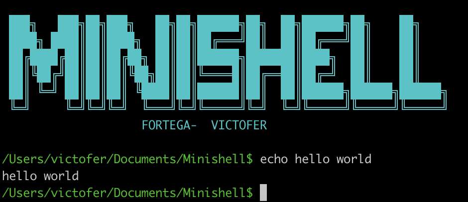

# :shell: MINISHELL

## INFO [:gb:]

#### Summary
> The objective of this project is for you to create a simple shell.

|   Keywords   |           Skills          |
|--------------|:-------------------------:|
| Unix logic   |           Unix            |
|              |           Rigor           |
|              |   Imperative programming  |

### STATUS

| Project status | FINISHED                |
|--------------|---------------------------|
| Proyecto mark |    |

#### CLONE REPO
~~~~~
git clone https://github.com/victorFernandezF/Minishell.git
~~~~~

#### PREVIEW IMAGE

## INFO [:es:]

#### Resumen 
> El objetivo de este proyecto es crear un sencillo shell.

|   Keywords   |           Skills          |
|--------------|:-------------------------:|
| Unix logic   |           Unix            |
|              |           Rigor           |
|              |   Imperative programming  |

### ESTADO

| Estado del proyecto | Finalizado         |
|--------------|---------------------------|
| Nota del proyecto   | |

#### CLONAR REPOSITORIO
~~~~~
git clone https://github.com/victorFernandezF/Minishell.git
~~~~~
#### IMAGEN

